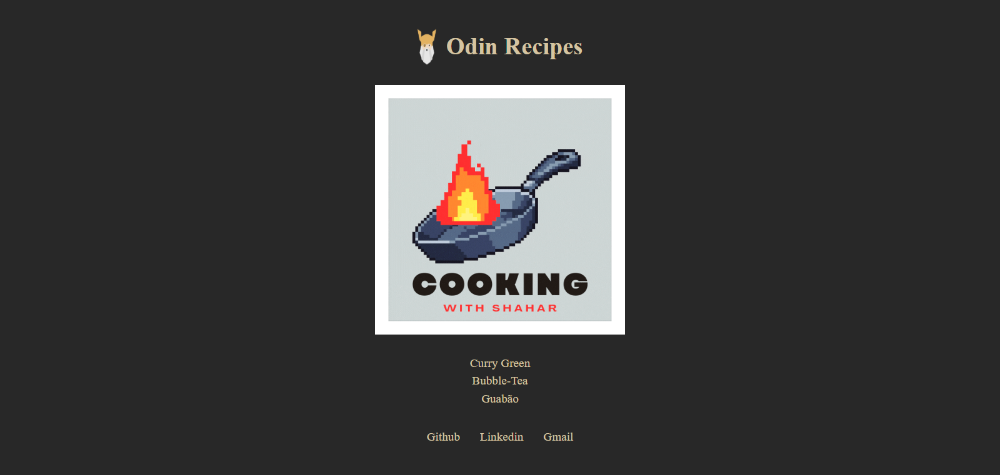

I'm always looking to improve my skills, so any feedback on the project, code, architecture, or best practices is very welcome! If you’d like to contribute with suggestions, you can:

📧 Send me an email: henrykaua21@gmail.com

🔗 Connect with me on [LinkedIn](https://www.linkedin.com/in/henry-kaua/)

🐛 Open an [issue](https://github.com/henrymzs/api-todolist/issues) in the repository 

Any help is greatly appreciated and contributes to my growth as a developer. 🚀

Odin Curriculum Project, where the objective was to build a page using only HTML to create a recipe page. However, I took the liberty of using CSS to style the page. Below is the final result.

